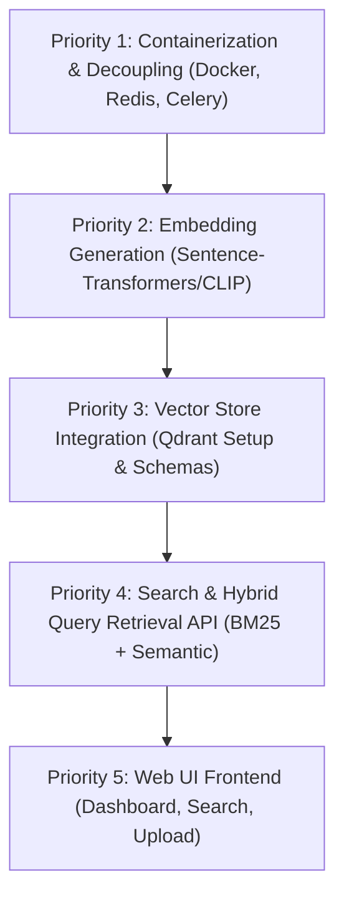

# Project Status Audit Report: AI Video Search Engine

This document provides a comprehensive status audit of the **AI Video Search Engine** codebase. It outlines the system goal, architecture, technology stack, end-to-end ingestion workflow, current performance profiles, completed capabilities, missing components, production readiness, and the prioritized roadmap.

---

## 1. Project Goal

### Business Goal
A CCTV Video Search Engine that allows security operators, system administrators, and investigators to search long, unstructured video footage using natural language queries.

### Problems Solved
- **Manual Review Overhead**: Eliminates the need for humans to watch hours of surveillance footage to locate specific incidents.
- **Semantic Understanding**: Converts raw video frames into rich semantic descriptions (captions, scene types, object listings, activity tags) rather than relying on basic pixel change detection.
- **OCR & License Plate Recognition**: Automatically extracts readable text and specifically parses Indian vehicle license plate formats.
- **Event-Level Summarization**: Aggregates highly redundant consecutive frames into descriptive, temporal events to compress the data footprint and provide a cleaner timeline interface.

### End-to-End Use Case
1. A security officer uploads a raw security camera video (e.g., `gate_1_morning.mp4`).
2. The ingestion pipeline extracts, filters, analyzes, and consolidates the footage into distinct semantic events.
3. The officer searches the database using queries like:
   - *"Show all blue cars entering the gate"*
   - *"Find a person carrying a backpack walking past the corridor"*
   - *"Show vehicles arriving at the office entry after sunset"*
4. The system returns the matching video segments, timestamps, license plates, summaries, and key frames instantly.

### Current Maturity Level
- **Ingestion Pipeline**: **Maturity Level: Beta/Stable**. The pipeline successfully streams uploads, extracts frames at 1fps, filters redundant frames adaptively, extracts OCR text, generates VLM structured metadata, groups frames into logical events, and serializes all results to disk with full error handling and performance tracking.
- **Retrieval & Search**: **Maturity Level: Pre-Alpha**. The search indexing, embedding generation, vector database storage, and retrieval API endpoints are not yet implemented.

---

## 2. Current Ingestion Architecture

The diagram below details the ingestion workflow, indicating the services and file paths involved at each stage:

```text
[Raw Video File]
       ↓ (FastAPI upload endpoint: /videos/upload)
[Storage: data/videos/{video_id}.mp4]
       ↓ (Triggered via: /frames/extract)
[Frame Extraction Service] (OpenCV seeks frame-by-frame at 1fps)
       ↓
[Adaptive Frame Sampling] (Histogram, SSIM, and Motion Differencing checks)
       ↓
       ├─► [Skip visually redundant frames]
       ↓
[OCR Processing Service] (EasyOCR CPU-based text extraction & plate matching)
       ↓
[Qwen VLM Inference Service] (Qwen2.5-VL-7B-Instruct with 4-bit BnB quantization)
       ↓
[JSON Repair & Pydantic Validation] (Ensures strict schema format)
       ↓
[Event Aggregation Service] (Groups consecutive similar frames, infers event type)
       ↓
[Disk Serialization Storage]
       ├─► Individual Frame JSONs: data/metadata/{video_id}/{frame_id}.json
       ├─► Consolidated Frame Catalog: data/metadata/{video_id}_frames.json
       └─► Aggregated Event JSONs: data/events/{video_id}/{event_id}.json
```

### Services and Core Source File Mappings
- **FastAPI Core & Routes**: [main.py](file:///c:/Mukul%20K/vinfo1/video-search-engine/app/main.py), [videos.py](file:///c:/Mukul%20K/vinfo1/video-search-engine/app/api/videos.py), [frames.py](file:///c:/Mukul%20K/vinfo1/video-search-engine/app/api/frames.py).
- **Video Storage Manager**: [video.py](file:///c:/Mukul%20K/vinfo1/video-search-engine/app/services/video.py).
- **Ingestion Pipeline Coordinator**: [frame.py](file:///c:/Mukul%20K/vinfo1/video-search-engine/app/services/frame.py).
- **EasyOCR Processor**: [ocr.py](file:///c:/Mukul%20K/vinfo1/video-search-engine/app/services/ocr.py).
- **Qwen VLM Inference Wrapper**: [qwen_vlm.py](file:///c:/Mukul%20K/vinfo1/video-search-engine/app/services/qwen_vlm.py).
- **Event Aggregator Service**: [event_aggregation.py](file:///c:/Mukul%20K/vinfo1/video-search-engine/app/services/event_aggregation.py).
- **Profiling and Log Metrics**: [profiler.py](file:///c:/Mukul%20K/vinfo1/video-search-engine/app/core/profiler.py), [logging.py](file:///c:/Mukul%20K/vinfo1/video-search-engine/app/core/logging.py).

---

## 3. Technology Stack

Every package and dependency currently utilized in the system is summarized below:

| Layer | Technology | Version / Spec | Purpose |
| :--- | :--- | :--- | :--- |
| **Backend Framework** | FastAPI | `>=0.110.0` | High-performance asynchronous API endpoints |
| **API Server** | Uvicorn | `>=0.28.0` | ASGI web server (running in development mode) |
| **Validation Layer** | Pydantic | `>=2.6.0` | Strict data validation and schema definitions |
| **Settings Management** | Pydantic Settings | `>=2.2.1` | Environment variables parsing and configuration |
| **Image Processing** | OpenCV | `opencv-python-headless>=4.9.0.80` | Frame decoding, histogram comparisons, and SSIM mapping |
| **Deep Learning Engine**| PyTorch | `>=2.2.0` | GPU/CPU compute execution layer for models |
| **VLM Model** | Qwen2.5-VL-7B-Instruct | `Qwen/Qwen2.5-VL-7B-Instruct` | Generates rich semantic frame captions, objects, and activities |
| **VLM Quantization** | BitsAndBytes | Quantization | Loads VLM in 4-bit mode (reducing VRAM footprint to ~5.5GB) |
| **VLM Utilities** | Hugging Face Transformers | `>=4.48.0` | Model configuration and auto-processors |
| **OCR Engine** | EasyOCR | English Reader | Extracts raw text from images on CPU |
| **Logger** | Loguru | `>=0.7.2` | Structured text/JSON logger with sandbox-safe queue fallback |
| **Storage** | Local Filesystem | Raw Disk | JSON documents and media assets stored in workspace `data/` |
| **Test Runner** | Pytest | `>=8.0.0` | Executes unit and integration tests |

---

## 4. End-to-End Ingestion Workflow

The following table traces a media file through each stage of the ingestion process:

| Stage | Input | Output | Files Involved | Services / Code |
| :--- | :--- | :--- | :--- | :--- |
| **1. Video Upload** | HTTP Multipart stream (`UploadFile`) | Video metadata JSON, stored raw file | `data/videos/{video_id}.mp4` | `VideoService` ([video.py](file:///c:/Mukul%20K/vinfo1/video-search-engine/app/services/video.py)) |
| **2. Frame Extraction** | Raw video path | Sequence of frame JPG buffers, timestamp info | `data/frames/{video_id}/frame_{idx:04d}.jpg` | `FrameExtractionService` ([frame.py](file:///c:/Mukul%20K/vinfo1/video-search-engine/app/services/frame.py)) |
| **3. Adaptive Sampling** | Extracted frame JPG, previous accepted frame | Boolean (`should_send`) | No files created if skipped; writes JPG to disk only if accepted | `FrameExtractionService.compute_similarity_metrics` |
| **4. OCR Processing** | Stored frame JPG path | List of text strings and license plates | Temporary lists during extraction | `OCRService` ([ocr.py](file:///c:/Mukul%20K/vinfo1/video-search-engine/app/services/ocr.py)) |
| **5. Qwen Inference** | Batched frame JPG paths (size=4) | Raw VLM JSON strings | Model VRAM buffer | `QwenVLMService.generate_metadata_batch` ([qwen_vlm.py](file:///c:/Mukul%20K/vinfo1/video-search-engine/app/services/qwen_vlm.py)) |
| **6. Metadata Generation**| Raw VLM string, OCR dictionary, timestamps | Validated Pydantic object | `data/metadata/{video_id}/{frame_id}.json` | `FrameRichMetadata` ([schemas/frame.py](file:///c:/Mukul%20K/vinfo1/video-search-engine/app/schemas/frame.py)), `json_repair` |
| **7. Event Aggregation** | Complete list of frame metadata dicts | Unified events, individual event JSONs | `data/events/{video_id}/{event_id}.json` | `EventAggregationService` ([event_aggregation.py](file:///c:/Mukul%20K/vinfo1/video-search-engine/app/services/event_aggregation.py)) |
| **8. Profiling & Reports**| Execution times and extraction stats | Markdown reports, performance logs | `data/logs/performance.log`, `PERFORMANCE_REPORT.md`, `ADAPTIVE_SAMPLING_REPORT.md`, `EVENT_AGGREGATION_REPORT.md` | `PerformanceTracker` ([profiler.py](file:///c:/Mukul%20K/vinfo1/video-search-engine/app/core/profiler.py)) |

---

## 5. Current Performance Profiling

### Ingestion Metrics Summary (Actual System Log Benchmarks)
Below are representative execution metrics compiled from [performance.log](file:///c:/Mukul%20K/vinfo1/video-search-engine/data/logs/performance.log) runs under CUDA GPU execution:

- **Average Frame Extraction (OpenCV)**: ~20 ms to 45 ms per frame.
- **Average CPU EasyOCR Processing**: ~848 ms per frame.
- **Average Qwen VLM Inference (CUDA)**: ~5,792 ms to 7,038 ms per frame (optimized down from 25,000 ms via `max_new_tokens=256`).
- **Average JSON Repair & Pydantic Validation**: ~0.1 ms to 15 ms.
- **Average Disk Metadata Writes**: ~0.5 ms.

### Throughput Profiles
For a typical 6-second video processed at 1fps:
- **Total Frames Extracted**: 6
- **Total Ingestion Time**: ~48.51 seconds
- **Bottleneck Distribution**:
  - **Qwen VLM Inference**: **~87% to 94% of total runtime**
  - **OCR Processing (CPU)**: **~6% to 12% of total runtime**
  - **All other tasks (Extraction, Validation, I/O)**: **< 1% of total runtime**

### Performance Limitations
1. **CPU OCR Bottleneck**: `EasyOCR` is locked to CPU mode (`gpu=False`) to avoid colliding with Qwen's large VRAM footprint, which limits text extraction speeds.
2. **Synchronous Core Loop**: The ingestion pipeline operates sequentially over video batches. Multiple videos uploaded concurrently will block the main thread.
3. **Inference Latency**: Large Vision-Language Models (VLM) like Qwen2.5-VL-7B-Instruct naturally require high compute resources, yielding 5 to 7 seconds per inference step on moderate hardware.

---

## 6. Completed Features

All currently implemented features have been fully coded, verified, and automated using tests:

| Feature Component | Status | Details |
| :--- | :--- | :--- |
| **Video File Upload** | `Implemented & Verified` | Validates file extensions (`.mp4`, `.avi`, `.mov`) and writes streaming chunks to disk to prevent RAM bloat. |
| **Video Metadata Catalog** | `Implemented & Verified` | Persists individual uploads in a JSON catalog and maintains catalog index queries. |
| **Frame Extraction** | `Implemented & Verified` | Extracts frames at 1fps using OpenCV seek operations with transactional folder cleanup on failures. |
| **Adaptive Sampling** | `Implemented & Verified` | SSIM, histogram correlation, and pixel differencing motion detection checks skip redundant frames to minimize VLM calls. |
| **EasyOCR Integration** | `Implemented & Verified` | Non-blocking CPU-based text extraction with regex pattern matching for Indian license plates. |
| **Qwen VLM Ingestion** | `Implemented & Verified` | Invokes 4-bit quantized VLM batch processes with the optimized `QWEN_MAX_NEW_TOKENS=256` default settings. |
| **Robust JSON Repair** | `Implemented & Verified` | Sanitizes code block fences and corrects malformed JSON brackets before Pydantic parsing. |
| **Event Aggregation** | `Implemented & Verified` | Groups consecutive similar frames into semantic events using a combined SequenceMatcher and Jaccard index similarity ratio. |
| **Pipeline Performance Profiler**| `Implemented & Verified` | Performance logs and automated performance reports (`PERFORMANCE_REPORT.md`, `ADAPTIVE_SAMPLING_REPORT.md`, `EVENT_AGGREGATION_REPORT.md`). |
| **Verification Test Suite** | `Implemented & Verified` | Global conftest forcing mock model runs, safe multiprocess logger fallback, and 20 passing unit/integration tests. |

---

## 7. Missing Components

To achieve production deployment, the following major gaps must be resolved:

1. **Embeddings Generator**: Need a sentence-transformer or CLIP module to convert frame captions, event summaries, and keyword lists into high-dimensional vector embeddings.
2. **Vector Database**: A vector database indexing service (e.g., Qdrant or FAISS) to store text vectors and allow fast cosine-similarity searches.
3. **Search & Retrieval API**: Endpoints (e.g., `GET /search`) to receive natural language queries, vectorize them, and retrieve matching events.
4. **Hybrid Search System**: Hybrid query ranking combining semantic vector search with BM25 keyword matching for OCR text and license plates.
5. **Background Task Queue**: Celery or RQ workers to decouple heavy VLM/OCR processing from web servers, executing ingestion asynchronously.
6. **Authentication & Authorization**: API Key/JWT authentication to protect uploads, downloads, and search endpoints.
7. **User Interface (Frontend)**: A web dashboard to upload videos, view timelines, display cropped license plates, and run natural language searches.
8. **Containerization**: Docker and Docker Compose files to manage multi-container services (FastAPI, Qdrant, Celery, Redis).

---

## 8. Production Readiness Assessment

### Overall Scorecard

| Component | Status | Strengths | Weaknesses |
| :--- | :--- | :--- | :--- |
| **Ingestion Pipeline** | **Medium-High** | Resilient disk rollback, batched execution, and robust schema validation. | Asynchronous worker queue is missing; sequential OCR bottleneck. |
| **Metadata Quality** | **High** | Strict Pydantic models, custom formatting, and automatic JSON repair fallbacks. | Dependent on VLM output parsing and prompt structure. |
| **Event Aggregation** | **High** | Unique object attribute merging, temporal boundaries tracking, and chronological summary creation. | Relies on default `0.70` threshold which may need tuning for extreme motion. |
| **Search Capability** | **None** | No search endpoints or indexes have been built yet. | Entire search, vector storage, and retrieval stack is missing. |
| **Scalability** | **Low** | Batch processing is optimized. | Lacks celery worker horizontal scaling; raw file system acts as the database. |
| **Monitoring** | **Medium** | Structured execution logs and auto-generated performance profiling reports. | No Prometheus metrics, health checks, or live monitoring dashboards. |
| **Deployment** | **Low** | Well-documented settings configurations. | No Dockerfiles, Compose orchestration, or cloud configurations. |

---

## 9. Recommended Next Steps (Roadmap)

To bring the project to production, engineering efforts should prioritize the following phases:



### Prioritized Tasks

#### Priority 1: Containerization & Decoupling
- **Goal**: Add Dockerfiles, Redis, and Celery worker tasks.
- **Why**: Decouples video uploading from heavy CPU/GPU ingestion processing. This ensures FastAPI remains responsive under load and failures do not crash the web server.

#### Priority 2: Embedding Generation
- **Goal**: Integrate a local transformer model (e.g., `sentence-transformers/all-MiniLM-L6-v2`) to generate vector representations of captions and events.
- **Why**: Converts textual metadata descriptions into coordinate vectors, enabling semantic comparison.

#### Priority 3: Vector Store Integration
- **Goal**: Spin up a Qdrant container and build a sync client inside FastAPI to index frame/event vectors and payloads.
- **Why**: Enables fast, indexed database storage instead of scanning local JSON files.

#### Priority 4: Search & Hybrid Query API
- **Goal**: Implement `GET /search` using hybrid search logic: vector similarity for semantic search and BM25/keyword search for specific tags and OCR license plates.
- **Why**: Delivers the actual natural language search interface that users interact with.

#### Priority 5: Web UI Dashboard
- **Goal**: Create a lightweight React or Next.js user interface.
- **Why**: Enables non-technical users to upload videos, search, and view visual segments.
